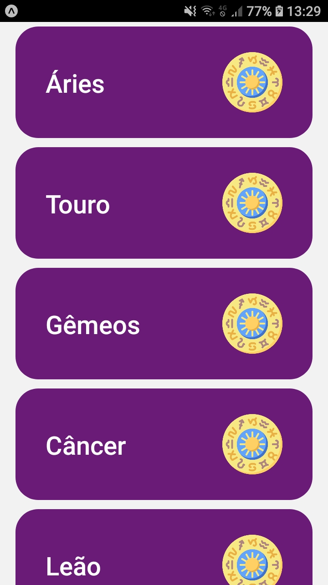
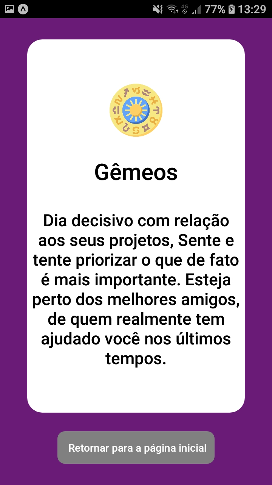

<h1><strong>Horoscopo</strong></h1>

 
 
<strong><h2>🎯 Sobre</h2></strong>

A proposta desse desenvolvimento consiste na consulta de horoscopo.

 
 <strong><h2>🛠️ Tecnologias usadas</h2></strong>

[- <strong>React Native</strong>](https://reactnative.dev/docs/getting-started)

 
<strong><h2>⚙️ Instalação</h2> </strong>

<strong>🔙 Pré-requisito </strong>

Antes de começar, você precisará ter instalado em seu computadore as seguintes ferramentas: [Git](https://git-scm.com/) , [Node.js](https://nodejs.org/en/) e [Yarn](https://yarnpkg.com/) .
Além disso, é bom ter um editor para trabalhar com seu código, como o [VSCode](https://code.visualstudio.com/).

[- <strong> React Native - EXPO </strong> ](https://expo.io/)
Você pode clicar no link acima para realizar todo o processo de instalação da EXPO (Para simular android/IOS).

 

<strong>🔽 Clonando o repositório </strong>

<pre>via HTTPS
$ git clone https://github.com/realcaldeira/horoscopo.git </pre>

<strong>🖥️ Iniciando o aplicativo</strong>

<pre>
# Acesse a pasta com comando <strong>cd </strong> 

# Volte para a pasta anterior do aplicativo 
$ cd ..

# Instale as dependências
$ yarn

# Inicie a API
$ yarn api

# Inicie o projeto
$ expo start

<strong>Aponte seu ceular para o QR CODE.. E PRONTO.</strong>

Este projeto foi feito com ❤ por Lucas Caldeira
